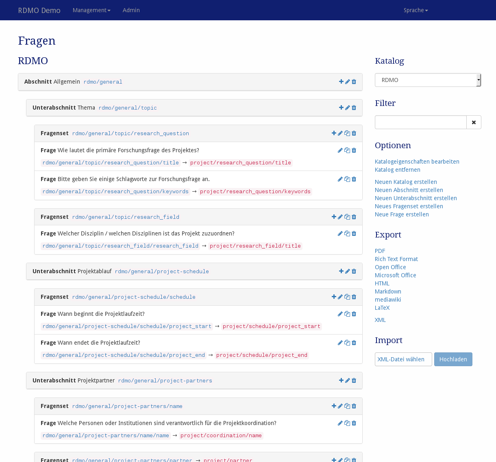

# Fragen

Das Fragenmanagement ist unter *Fragen* im Managementmenü in der Navigationsleiste verfügbar. Direkt nach einer RDMO-Instalation ist dieser Bereich zunächst leer. Wir empfehlen **zuerst erst unser Domänenmodell** und ggf. auch unseren generischen Fragenkatalog zu importieren. Die entsprechenden XML-Dateien finden Sie unter <https://github.com/rdmorganiser/rdmo-catalog>

Falls bereits mindestens ein Fragenkatalog vorhanden ist, so wird dieser automatisch angezeigt. Weitere Kataloge können in der Seitenleiste darunter ausgewählt werden.

> *Screenshot des Fragenmangements-Interfaces*

Auf der linken Seite werden die Abschnitte, Fragensets und Fragen des aktuellen Katalogs angezeigt. Für Abschnitte und Fragensets wird der Titel und Schlüssel angezeigt. Für Fragen und Fragensets wird der Schlüssel und der Schlüssel des verknüpften Attributes angezeigt. Die Reihenfolge der verschiedenen Elemente ist die Gleiche wie im strukturierten Interview, welches den Nutzenden angezeigt wird. Auf der rechten Seite eines jeden Elementfeldes zeigen Symbole die Interaktionsmöglichkeiten an. Folgende Optionen sind verfügbar:

* **Hinzufügen** () eines neuen Abschnittes, eines Fragensets oder einer Frage.
* **Bearbeiten** () eines Elements, um seine Eigenschaften zu ändern.
* **Kopieren** () einer Frage oder eines Fragekatalogs. Dies wird das gleiche Fenster öffnen wie das Bearbeiten. Es können einige der Eigenschaften verändert werden und das Element wird als ein neues Element gespeichert. Dies kann Zeit sparen wenn mehrere ähnliche Fragen erstellt werden.
* **Löschen** () eines Elements und all seiner Abkömmlinge (z.B. Fragensets und all dessen Fragen). **Diese Aktion kann nicht rückgängig gemacht werden!**

Der Sidebar rechts enthält weitere Bedienelemente:

* **Katalog** wechselt zu der Ansicht eines anderen Katalogs.
* **Filter** filtert die Ansicht anhand eines vom Benutzer eingegebenen Strings. Nur Elemente, die diese Zeichenkette in ihrem Pfad enthalten, werden gezeigt.
* **Optionen** enthält weitere Operationen:

  * Katalogeigenschaften bearbeiten
  * Katalog entfernen
  * Neuen Katalog erstellen
  * Neuen Abschnitt erstellen
  * Neuen Frageset erstellen
  * Neue Frage erstellen

* **Export** exportiert den aktuellen Katalog in eines der angebotenen Formate. Während Textformate hauptächlich für Präsentationszwecke sind, können XML-Exporte für den Transfer des Kataloges zu einer anderen RDMO-Installation verwendet werden.

Die verschiedenen Elemente des Fragebogens haben verschiedenen Eigenschaften, um ihr Verhalten zu beschreiben. Wie in [der Einleitung](../index.html) erwähnt, haben alle Elemente einen URI-Präfix, einen Schlüssel und einen internen Kommentar, die nur dem Manager der RDMO-Installation zugänglich sind. Außerdem können folgende Parameter geändert werden:

## Parameter

### Katalog

|Name|Beschreibung|
|-|-|
|Reihenfolge|Bestimmt die Reihenfolge des Katalogs in der Liste oder der Interview-Ansicht|
|Titel (en)|Der englische Titel für den Katalog, der dem Benutzer angezeigt wird|
|Titel (de)|Der deutsche Titel für den Katalog, der dem Nutzer angezeigt wird|

### Abschnitt

|Name|Beschreibung|
|-|-|
|Katalog|Der Katalog zu dem der Abschnitt gehört. Ändern des Katalogs wird den  Abschnitt zu einem anderen Katalog verschieben. Daher wird er dann nicht mehr in der aktuellen Ansicht sichtbar sein
|Reihenfolge|Bestimmt die Reihenfolge des Abschnittes in der Liste oder der Interview-Ansicht|
|Titel (en)|Der englische Titel des Abschnittes, der dem Benutzer angezeigt wird|
|Titel (de)|Der deutsche Titel des Abschnittes, der dem Benutzer angezeigt wird|

### Fragenset

|Name|Beschreibung|
|-|-|
|**Tab Allgemein**||
|Abschnitt|Der Abschnitt zu dem das Frageset gehört. Ändern des Abschnitts verschiebt die Frage zu einem anderen Abschnitt|
|Reihenfolge|Bestimmt die Position des Fragesets in der Liste oder der Interview-Ansicht|
|Attribut|Das Attribut mit dem Fragenset verknüpfte Attribut. Wird nur benötigt wenn **Ist eine Sammlung** aktiviert ist|
|Ist eine Sammlung|Legt fest ob jede Frage im Fragenset jewails für verschiedene Sets (z.B. Datensätze oder Projektpartner) beantwortet werden kann|
|**Tab Englisch**||
|Titel (en)|Der englische Titel des Fragensets, der dem Benutzer angezeigt wird|
|Hilfe (en)|Der englische Hilfetext des Fragensets|
|Name|Der englische Name der für die Sets verwendet wird, wenn **Ist eine Sammlung** aktiviert ist (z.B. dataset)|
|Plural name|Der englische Name im Plural der für die Sets verwendet wird, wenn **Ist eine Sammlung** aktiviert ist (z.B. datasets)|
|**Tab Deutsch**|*enthält die gleichen Informationen wie der der englischen Sprache, jedoch in Übersetzung.*|
|**Tab Bedingungen**|
|Bedingungen|Zeigt die mit dem Fragenset verknüpften Bedingungen an. Wenn **alle** der ausgewählten Bedingungen negativ evaluiert werden, wird das Frageset im Interview übersprungen|

### Fragen

|Name|Beschreibung|
|-|-|
|**Tab Allgemein**||
|Fragenset|Das Fragenset zu dem die Frage gehört. Ändern des Fragensets verschiebt die Frage zu einem anderen Fragenset|
|Reihenfolge|Bestimmt die Position des Fragensets in der Liste oder der Interview-Ansicht|
|Attribut|Das Attribut des Domänenmodels dem die Frage zugeordnet ist. Die Antworten der Nutzenden werden in der Datenbank diesem Attribut zugeordnet und in Aufgaben oder Ansichten werden diese Antworten über das Attribut referenziert|
|Ist eine Sammlung|Legt für die Frage mehrere Antworten eingegem werden können. In diesem Fall werden zusätzliche Elemente im Interview angezeigt um Antworten hinzuzufügen bzw. zu entfernen|
|Widget-Typ|Die Art des Widgets für die Frage.  Folgende Widgets können gewählt werden: - **Text** (Ein Einzeiler-Textfeld) - **Textarea** (Ein Mehrzeiler-Textfeld) - **Yes/No** (Ein Set aus Radio Buttons für "Ja" und "Nein") - **Checkboxes** (Ein Set aus Checkboxen, das verknüpfte Attribut &nbsp;&nbsp;muss eine Kollektion sein) - **Radio Buttons** (Ein Set aus Radio buttons, das verknüpfte &nbsp;&nbsp;Attribut muss ein Optionenset sein) - **Select drop down** (Ein Dropdown-Menu, das verknüpfte Attribut &nbsp;&nbsp;muss ein Optionenset haben) - **Range slider** (Ein horizontaler Schieber, das verknüpfte Attribut &nbsp;&nbsp;muss einen Wertebereich haben) - **Date picker** (Ein Dropdown-Element mit einem Kalender, &nbsp;&nbsp;um ein Datum zu wählen. Das verknüpfte Attribut &nbsp;&nbsp;muss vom Datentyp Datetime sein)|
|Wert-Typ|Die Art von Wert, der für diese Frage eingegeben werden kann. Zur Auswahl stehen: Text, URL, Ganzzahl, Kommazahl, Boolsche Variable, Datum und Zeit, Option|
|Einheit|Die Maßeinheit für diese Frage|
|**Tab Englisch**||
|Text|Der englische Text für die Frage. Der Text wird in fett gedruckt dem Benutzer angezeigt|
|Hilfe|Der englische Hilfetext für die Frage. Der Hilfetext wird dem Benutzer in grau angezeigt|
|Name|Der englische Name der für die einzelnen Antworten verwendet wird, wenn **Ist eine Sammlung** aktiviert ist (z.B. item)|
|Plural name|Der englische Name im Plural der für die einzelnen Antworten verwendet wird, wenn **Ist eine Sammlung** aktiviert ist (z.B. items)|
|**Tab Deutsch**|*enthält die gleichen Informationen wie der der englischen Sprache, jedoch in Übersetzung.*|
|**Tab Optionensets und Bedingungen**||
|Optionensets|Zeigt die mit der Frage verknüpften Optionensets an. Für die **Widget-Typen** Checkboxes, Radio Buttons und Select drop down enthalten die Optionensets die möglichen Anwortoptionen|
|Bedingungen|Zeigt die mit der Frage verknüpften Bedingungen an. Zur Zeit hat die Auswahl noch keinen Effekt, könnte aber in Zukunft verwendet werden|
|**Tab Bereich**||
|Minimum|Minimaler Wert für den **Widget-Typ** Range-Slider|
|Maximum|Minimaler Wert für den **Widget-Typ** Range-Slider|
|Schrittgröße|Schrittgröße für den **Widget-Typ** Range-Slider|
